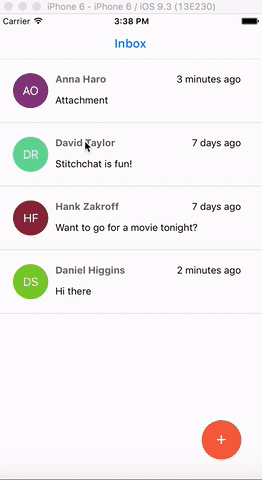
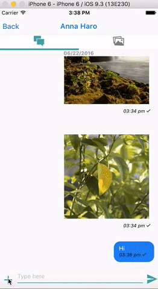

# stitchchat

General purpose messaging app built with react native. Created this to learn react native. The app uses the following dependencies,

1. Twitter Digits - for login using phone number
2. Firebase - for backend
3. AWS S3 for media storage

# Appstore link
https://itunes.apple.com/us/app/stitchchat/id1124511781?mt=8

# Demo

# How to install:

1. Install cocoapods
2. npm install

# Configurations

1. Install twitter fabric as detailed here, https://docs.fabric.io/ios/fabric/cocoapods.html
2. Update Fabric consumer key and secret in Info.plist
3. (optional) specify Microsoft code push key in Info.plist for remote updates.
4. Update server url in source/AppConstants.js. 
5. The compose message action will show all contacts instead of registered contacts(for testing purpose). You can easily change this by setting showRegistered = true in line#20 of app/container/ContactsPage.js 
